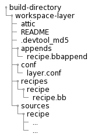

# Devtool 
Official documentation: [Devtool](https://docs.yoctoproject.org/sdk-manual/extensible.html)  

This command-line tool provides a number of features that help you build, test, and package software working with yocto.  
The ```devtool``` command line is organized similarly to GIT, where it has a number of sub-commands for each function. 
You can run ```devtool --help``` to see all the commands.
## Workspace and extensible SDK
To work with ```devtool``` command-line it is needed use a "Workspace" layer in which to accomplish build. This layer is not specific to any single devtool command but is rather a common working area used across the tool.



> attic - A directory created if devtool believes it must preserve
        anything when you run "devtool reset".  For example, if you
        run "devtool add", make changes to the recipe, and then
        run "devtool reset", devtool takes notice that the file has
        been changed and moves it into the attic should you still
        want the recipe.

> README - Provides information on what is in workspace layer and how to
         manage it.

> .devtool_md5 - A checksum file used by devtool.

> appends - A directory that contains *.bbappend files, which point to
          external source.

> conf - A configuration directory that contains the layer.conf file.

> recipes - A directory containing recipes.  This directory contains a
          folder for each directory added whose name matches that of the
          added recipe.  devtool places the recipe.bb file
          within that sub-directory.

> sources - A directory containing a working copy of the source files used
          when building the recipe.  This is the default directory used
          as the location of the source tree when you do not provide a
          source tree path.  This directory contains a folder for each
          set of source files matched to a corresponding recipe.
## devtool add  
Assits in adding new software to be built.  
1. Add application  
Generates a new recipe based on existing source code, it is flexible enough to allow you to extract source code into both the workspace or separate local Git repository.  
1.1 Generate the new recipe: ```devtool add recipe example``` .  
1.2 Edit the recipe: ```devtool edit-recipe example```.  
1.3 Build the recipe: ```devtool build example```  
1.4 Rebuild the image: ```devtool build-image image_example```  
1.5 Deploy the build output: ```devtool deploy-target```.  
1.6 Finish your work with the recipe: ```devtool finish recipe layer```.  


## Activity
For this chapter you should:
1. Create a new recipe
2. Modify the source built by a recipe
3. Upgrade a recipe to a new version


