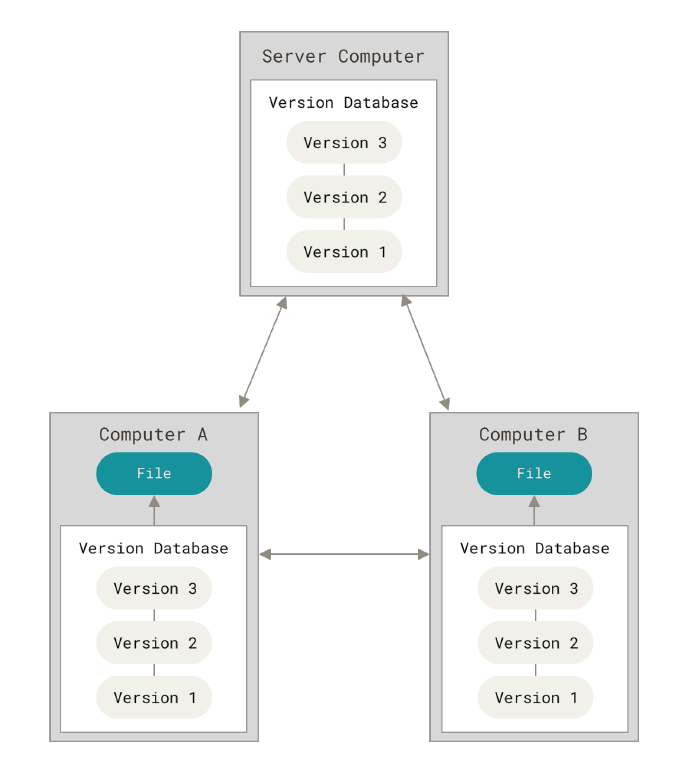
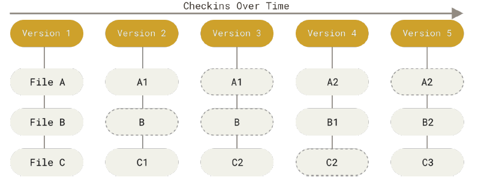
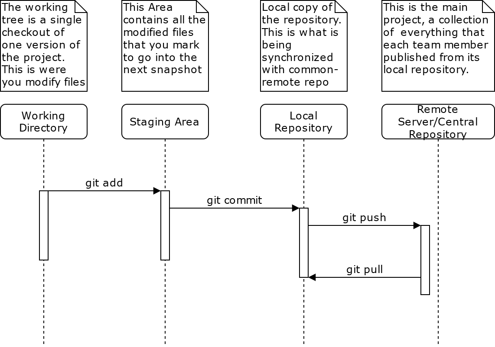

# Git
## What is git?
The first thing you will hear about git is that "Git is a distributed version control system" so lets start by understanding what is a Version Control Systems(VCS).

A Version Control System records changes to a file or set of files over time so that you have a history of them. An example of a VCS that you most likely already use is Word, Word has built-in feature "track changes" that allows us to visualize differences between 2 file versions; although hopefully by now you know that Word is rather slow and only works for its own files, so here we will see a faster and optimized tool for multiple file types. In contrast, a well designed VCS has the following features: 
- Revert selected files back to a previous state, or even the entire project back to a previous state.
- Compare changes between any 2 versions.
- See who last modified something that might be causing a problem, who introduced an issue,
when, and more.
Using a VCS also generally means that if you screw things up or lose files, you can easily
recover.

### Distributed VCS
Distributed Version control system means that every collaborator(any developer working on a team project)has a local repository of the project in his/her local machine which allow for faster and offline work possible,

### Storing files: snapshots vs deltas
Unlike most of the VCS that store file versions as Deltas(changes applied to a base file), Git stores SNAPSHOTS of all the files in the repository(unless file is identical, then it only links the last one). This decision will be clearer when we explain git branching; but for now, know that these copies make comparisons faster and they also get compressed so no need to worry too much about the size.

Furthermore, git has integrity check via 40 character SHA-1 hash, over the contents of each commit.
### Lifecycle of file status
Below you can see the 4 states of our files and the commands by which they change, these states exist to organize our files and only push files that we want everyone else to see:

Note that, since we own a copy of the repository nearly all operations are local, except for synchronizing
changes with the main server which make your changes visible to everyone else.

### Git branching
Branching means you diverge from the main line of development and continue to do work without messing with that main line. Commonly mainline refers to whats is in production, or already working, and to branch means to make a "shallow copy" of the current snapshot as a base for a new line of development. Branching looks like this:

## Reading more
To understand more about git its recommended to read the [official book](https://git-scm.com/book/en/v2).

To practice branching my personal recommendation is this website: [learn git branching](https://learngitbranching.js.org/) 

